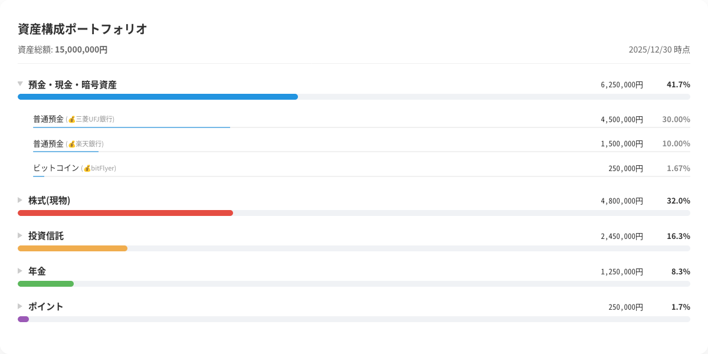

# MF Portfolio Ranking Pro 仕様書

## 1. プロジェクト概要

マネーフォワード ME の「資産内訳」ページ（`/bs/portfolio`）に存在するデフォルトの円グラフを非表示にし、資産クラスおよび個別資産の**「金額順ランキングバーチャット」**を最上部に動的生成します。各資産クラスをクリックすることで、その内訳（個別銘柄・口座）を詳細表示できるドリルダウン機能を備えています。

## 2. システム構成

* **プラットフォーム**: Firefox アドオン (Manifest V3)
* **対象URL**: `https://moneyforward.com/bs/portfolio*`
* **実行タイミング**: ページ読み込み中（DOM変更を検知し即時実行）

## 3. 主要機能詳細

### A. 資産クラス別ランキング（メインビュー）

* **ソート順**: 総資産に対する評価額（`y` 値）の降順。
* **表示項目**: 資産クラス名、合計金額、総資産に対する割合（%）、アセットカラーに対応したプログレスバー。
* **動的表示**: ページ内の `assetClassRatio` 変数から直接データを取得。

### B. ドリルダウン機能（詳細ビュー）

資産クラスをクリックすると展開される詳細リストの仕様です。

| 資産クラス | 表示項目（1行内） | 備考 |
| --- | --- | --- |
| **預金・現金** | 名称、保有金融機関名、残高、割合 | 💰️などの絵文字も保持 |
| **株式（現物）** | 銘柄名 (コード)、保有金融機関名、評価額、割合 | 銘柄コードをカッコ書きで付与 |
| **投資信託** | 銘柄名、保有金融機関名、評価額、割合 |  |
| **年金** | 名称、現在価値（評価額）、割合 | 保有金融機関名は非表示 |
| **ポイント** | 名称、保有金融機関名、現在の価値、割合 | 円換算額を優先表示 |

### C. ミニ・プログレスバー

* 詳細項目の各行下部に、**総資産に対するその項目の占有率**を可視化する2pxのバーを表示。
* バーの色は資産クラスの色（例：預金＝青、株式＝赤）と同期し、透過度を 0.6 に設定して視認性を調整。
* このバーが詳細行の区切り線（罫線）を兼ねるミニマルデザイン。

### D. UI/UX 仕様

* **垂直整列**: 「円」と「%」の単位が、メインビューと詳細ビューで垂直に一直線に並ぶよう、右側数値エリアを `220px` の固定幅で管理。
* **フォント**: 金額部分には等幅フォント（`monospace`）を適用し、桁数の違いによるガタつきを防止。
* **日付**: 右上に `YYYY/MM/DD` 形式でシステム日付を表示。

## 4. 技術的特記事項

### パフォーマンス最適化（ゼロ・ラグ実行）

* `setTimeout` による固定待機を廃止し、`MutationObserver` を採用。
* ブラウザがマネーフォワードのデータを DOM に展開、またはグローバル変数にセットした瞬間を検知して即座に `injectChart()` を実行。

### Firefox サンドボックス対策

* Firefox 拡張機能特有の `Xray vision` 制限を回避するため、`window.wrappedJSObject` を経由してページコンテキスト内の `assetClassRatio` 配列を取得。

### データの整合性

* 各資産テーブルのヘッダーテキスト（例：「残高」「現在の価値」など）をスキャンして列インデックスを動的に特定。テーブル構造のマイナーチェンジに強い設計。

## 5. ファイル構成

ロジックとデザインを分離し、保守性を向上させました。

1. **`manifest.json`**: 拡張機能の定義。`style.css` と `content.js` をページに注入します。
2. **`style.css`**: UIの全デザイン定義。レイアウト、アニメーション、三点リーダによる省略処理を担当します。
3. **`content.js`**: ページデータの抽出、計算、およびHTML構造の生成を担当します。

## 6. 開発・デバッグ用ツール

### ダミーデータの生成 (`dummy-data.js`)

開発時のレイアウト確認や、プライバシーを保護した状態でのスクリーンショット撮影のために、ページ内のデータを一時的にダミーへ置き換えるスクリプトを利用可能です。

#### 実行方法

1. マネーフォワードの資産内訳ページで `F12` キーを押し、コンソール（Console）タブを開きます。
2. 別ファイルの `dummy-data.js` の内容をコピー＆ペーストして実行します。
3. ページ内の実データが、合計1,500万円程度のバランスの取れたダミー資産（トヨタ、Apple、eMAXIS Slim等）に書き換わり、即座にランキングチャートが再描画されます。

#### 主なデバッグ項目

* **名称の省略**: 長い銘柄名（eMAXIS Slim等）が三点リーダで正しく省略されるか。
* **カラー同期**: 各資産クラスの色が、詳細のミニプログレスバーに正しく反映されているか。
* **空データ処理**: 保有額が0円の資産クラスがランキングから除外されているか。

> **注意**: このスクリプトによる書き換えはメモリ上の一時的なものです。ページをリロードすると元の実データ表示に戻ります。

